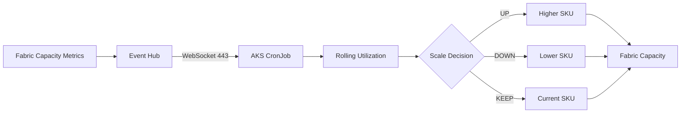

## Visual Architecture

## Overview

Microsoft Fabric Capacity를 고정 SKU나 단순 시간표만으로 운영하지 않고, **실제 Capacity Utilization을 기준으로 Scale Up/Down**하도록 구성한 운영 자동화입니다. 기존 Schedule 기반 Capacity Control을 유지하면서 업무시간 일부 구간의 제어권을 Dynamic Autoscale에 위임하여 운영 안정성과 비용 효율을 함께 고려했습니다.

## Problem

- 시간대별 실제 부하와 고정 Schedule 사이에 차이가 발생
- 높은 SKU를 필요 이상 유지할 경우 비용 낭비 가능
- Dynamic 정책을 단순 추가하면 기존 Schedule CronJob과 제어 충돌 가능
- STG/PRD별 Baseline SKU와 운영시간이 달라 환경별 정책 필요

## Architecture / Control Model

1. 기존 Schedule 정책이 업무 시작 시 Baseline SKU 적용
2. Dynamic Window 진입 후 Schedule 제어를 중단하고 Utilization Autoscale에 제어권 위임
3. 최근 Utilization을 Rolling Window로 평가
4. Scale Up / Scale Down 조건 충족 여부 판단
5. Fabric Capacity SKU 변경
6. Dynamic Window 종료 후 기존 Schedule 정책으로 제어권 반환

### Dynamic Window

- STG/PRD 평일 업무시간을 대상으로 Dynamic 제어구간 운영
- Schedule 정책과 Dynamic Autoscale의 실행 구간을 명시적으로 분리
- 월요일 업무 시작 시 Capacity Start/Control CronJob 간 실행시간 충돌 가능성을 분석하고 실행시각 분리 검토

## Implementation

- Python 기반 Capacity Utilization 판단 로직 구현
- AKS Kubernetes CronJob을 실행 주체로 구성
- Fabric Event Hub 이벤트 수신 구조 검증
- AKS 환경에서 AMQP 5671 제한 상황을 확인하고 WebSocket 443 기반 Event Hub 연결 검증
- 환경별 STG/PRD Capacity와 SKU Ladder 분리
- Rolling Utilization 기반 연속 조건 판단
- Scale Up / Scale Down 시 현재 SKU와 목표 SKU 비교 후 변경 수행
- Schedule Control과 Dynamic Control의 중복 실행 방지 로직 적용
- STG 선적용 및 동작 검증 후 PRD 확대 적용

## Production Validation

PRD 적용 후 실제 운영 로그를 통해 Capacity F32 상태에서 Rolling 평균 약 22.81%가 지속되어 Scale Down 조건을 만족하고 F16으로 전환되는 흐름을 검증했습니다. 이후 약 일주일간 기존 Schedule 기반 CronJob과 Dynamic CronJob 사이의 충돌 여부를 모니터링하여 정상 동작을 확인했습니다.

## Engineering Points

- 단순 Autoscale 구현이 아니라 **기존 운영 정책과 공존 가능한 Control Plane** 설계
- Schedule + Utilization Hybrid 방식으로 Baseline 안정성 확보
- STG → PRD 단계적 적용으로 운영 리스크 감소
- Event Hub / AKS / Fabric을 연결한 Cross-Service Automation 구현
- Capacity 운영을 FinOps 관점의 자동화 대상으로 전환

## Troubleshooting / Operational Notes

- Event Hub AMQP 5671 네트워크 제한 → WebSocket 443 연결 방식 검증
- 기존 Capacity Start/Stop CronJob과 Schedule Control 실행시간 충돌 가능성 분석
- Dynamic Window를 별도 정의하여 동일 Capacity에 대한 복수 Controller 충돌 방지
- 환경별 운영시간과 Baseline SKU 차이를 코드 정책으로 분리

## Result

- STG 검증 후 PRD 운영 적용
- Schedule 기반 운영과 Utilization 기반 Autoscale의 Hybrid 제어 구현
- 실제 사용량에 따라 Capacity SKU를 자동 조정할 수 있는 운영체계 확보
- Fabric Capacity 비용 최적화를 위한 FinOps 자동화 패턴 구현
