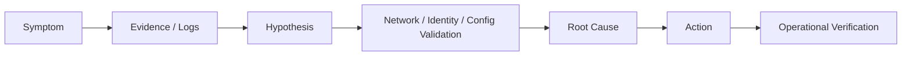

# Enterprise AI/Data Platform Platform Troubleshooting Archive

## Troubleshooting Pattern

## 01. Purpose
Enterprise AI/Data Platform Data Platform / Application Platform 환경에서 실제로 다룬 **Microsoft Fabric / AKS / GitLab CI/CD / ArgoCD / Network / Identity / Monitoring** 이슈를 결과만 나열하지 않고 `Symptom → Analysis → Cause → Action → Validation` 순서로 기록합니다. Career/Project 본문에는 대표 성과를 남기고, 이 문서는 실제 운영 과정에서 어떤 방식으로 문제 범위를 좁혔는지를 보존하는 원천 기록입니다.

---

## 02. Microsoft Fabric — Admin Activity API 403 → 400 → 정상 수집

### Symptom
Fabric Admin Activity Events API를 Service Principal로 호출했을 때 초기에는 `403 API not accessible`가 발생했고, 접근 조건 보완 후에는 `400 BadRequest`가 발생했습니다.

### Analysis
인증 실패와 Request Parameter 오류를 동일 문제로 보지 않고 단계적으로 분리했습니다. Service Principal/App Registration, Fabric 관리 권한, Tenant/Capacity 조건을 먼저 확인하고 API 접근이 가능해진 이후 Request Date Format을 재검토했습니다.

### Action / Result
- 필요한 API 접근 권한/관리 조건 보완
- API가 요구하는 날짜 형식으로 Parameter 수정
- Continuation 기반 다중 Page 수집 처리
- 수천 건 단위 Activity Event 수집 확인
- JSON 저장에서 운영 요구에 맞춘 CSV 저장으로 전환
- Pipeline 일일 실행 및 KST D-1 기본 수집 방식 적용

---

## 03. Fabric Audit Collection — Authorization / Tenant / Storage DNS

### Symptom
운영 자동화 과정에서 `Not authorized`, `Invalid tenant ID`, `apfabricdwquerylog.blob.core.windows.net DNS resolve failure` 등 서로 다른 오류가 발생했습니다.

### Analysis
API 인증, Tenant 설정, Storage Network를 각각 별도 계층으로 분리했습니다. 동일 Notebook 실패라도 Token 발급 단계인지 API 호출 단계인지, Storage FQDN 이름해석 단계인지를 로그로 구분했습니다.

### Action
- Tenant ID / Service Principal Parameter 재검증
- 권한 오류 시 Token/API 접근 단계를 분리 확인
- Notebook에 DNS Resolution Test 코드 추가
- Storage Private Connectivity / DNS / Firewall 상태 확인

### Result
인증 문제와 Network/DNS 문제를 구분할 수 있는 진단 포인트를 추가하여 운영 장애의 원인 범위를 빠르게 좁힐 수 있도록 했습니다.

---

## 04. Event Hub — AMQP 5671 차단 → WebSocket 443

### Symptom
AKS 환경에서 Event Hub 연결 시 AMQP TLS Port 5671 경로가 차단되어 Autoscale POC의 이벤트 수신이 정상적으로 이루어지지 않았습니다.

### Analysis
Event Hub Namespace, Consumer Group, Capacity Event 발생 여부와 Network Port를 분리 확인했습니다. 로컬 환경에서는 수신 가능하고 AKS에서만 제한되는 점을 통해 애플리케이션 로직보다 Network Policy를 우선 의심했습니다.

### Action / Validation
- `*.servicebus.windows.net` Endpoint 확인
- Consumer Group 기반 수신 테스트
- AMQP 5671 대신 WebSocket 443 방식 적용
- AKS/로컬 수신 결과 비교
- Fabric Eventstream Publish 및 Event 수신 확인

### Result
기업 Network에서 허용되는 443 경로를 사용하여 Event Hub 이벤트 수신을 검증했고, Dynamic Autoscale 데이터 흐름에 적용할 수 있는 통신 방식을 확보했습니다.

---

## 05. Fabric Dynamic Autoscale — Schedule / Dynamic Control 충돌 방지

### Context
기존에는 시간표 기반 Capacity Control Runbook이 SKU를 관리하고 있었고, 여기에 Utilization 기반 Dynamic Autoscale을 그대로 추가하면 동일 Capacity를 두 Controller가 동시에 변경할 가능성이 있었습니다.

### Analysis / Design
- STG/PRD 업무 시작 시 Schedule 정책이 Baseline SKU 적용
- 08:15~17:45 Dynamic Window에서는 Schedule 제어를 중단하고 Utilization Autoscale에 제어권 위임
- Window 종료 후 기존 Schedule 정책으로 제어권 반환
- STG에서 우선 검증한 뒤 PRD 적용

### Operational Validation
PRD `prod-fabric-capacity`에서 F32 상태와 Rolling 평균 `[22.81% × 5]`를 기준으로 Scale Down 조건이 충족되어 F16으로 변경되는 실제 실행 로그를 확인했습니다. 적용 후 약 일주일 동안 Schedule CronJob과 Dynamic CronJob의 충돌 없이 동작하는지 모니터링했습니다.

---

## 06. Existing Control CronJob — 월요일 08:00 충돌 가능성

### Symptom
기존 Schedule 기반 CronJob이 특정 월요일 업무 시작 시 정상 동작하지 않는 현상을 확인했습니다.

### Analysis
Schedule Capacity Control과 Fabric Stop/Start 관리용 Active CronJob의 실행 시점이 모두 08:00 부근에 위치해 있어 동시 실행 가능성을 점검했습니다.

### Direction
원인 확정 전에는 추측으로 단정하지 않고 기존 Runbook 코드와 실행 로그를 추가 확인하는 방향으로 정리했으며, 업무 시작 Baseline 적용 시간을 08:15 등으로 분리하는 방안도 검토했습니다.

---

## 07. Fabric 429 / Throttling

Fabric Capacity에서 429/Throttling이 발생할 때 단순 API 오류로 처리하지 않고 Capacity 부하, Workload 실행량, 호출 패턴, SKU 및 운영시간대를 함께 확인했습니다. Capacity 운영정책과 실제 Utilization을 함께 보는 경험은 이후 Dynamic Autoscale/FinOps 설계와 연결되었습니다.

---

## 08. Fabric Publish 404

### Symptom
Fabric Item Publish 과정에서 404 오류가 발생했습니다.

### Analysis / Action
API 자체 장애보다 대상 Resource/Item 식별값과 입력정보를 먼저 검토했고, 명칭/입력값의 오타를 수정했습니다.

### Result
`Security-Gorvernance-poc-DA` Publish가 정상 완료되는 것을 확인했습니다.

---

## 09. OPDG → Azure Storage Connection Credential 400

### Symptom
OPDG를 통해 Azure Blob Storage Connection을 생성할 때 `Invalid connection credentials (400)`가 발생했습니다.

### Analysis
Service Principal 방식의 Client ID/Secret/RBAC뿐 아니라 Gateway가 지원하는 인증방식과 실제 Connection Credential 처리방식을 비교했습니다. Network/IP/Firewall/MPEP 승인 상태도 함께 확인했습니다.

### Action / Result
인증 방식을 Organization으로 변경한 뒤 연결이 정상 생성되는 것을 확인했습니다. 이 과정에서 Network 문제와 Credential/Authentication 문제를 분리 검증했습니다.

---

## 10. Snowflake Connection — EOF during login-request

Fabric/데이터 연계 과정에서 Snowflake 로그인 단계의 EOF 오류를 확인하고, Connection Credential, Network Path, 인증방식을 중심으로 원인 범위를 분리했습니다. 연결 자체의 성공 여부만 보는 것이 아니라 어느 단계에서 Session이 종료되는지 확인하는 방식으로 접근했습니다.

---

# AKS / GitOps

## 11. ImagePullBackOff — ACR Image NotFound

### Symptom
`private-acr.example.azurecr.io/application-image:253961` Image Pull에서 `ImagePullBackOff / NotFound`가 발생했습니다.

### Analysis
ACR 접근권한 문제와 Image 자체 부재를 구분하기 위해 Kubernetes Event의 실제 Registry 응답을 확인했습니다. `failed to resolve reference ... NotFound`를 기준으로 Repository/Tag와 CI Build/Push 결과, Helm Values의 Image Reference를 대조했습니다.

### Result
Pod 자체나 AKS Scheduling 문제가 아니라 배포 Manifest가 참조하는 Registry Image 존재 여부 문제로 원인 범위를 좁혔습니다.

---

## 12. Deployment `spec.selector` Immutable

### Symptom
ArgoCD Sync에서 `Deployment.apps "demo-aibe-keyword-extractor-system" spec.selector: Invalid value ... field is immutable` 오류가 발생했습니다.

### Analysis
Helm Helper의 fullname 변경 전후와 기존 Deployment selector/label을 비교했습니다. Kubernetes Deployment의 Selector는 생성 이후 변경할 수 없는 필드이므로 단순 Patch/Sync로 해결할 수 없는 변경임을 확인했습니다.

### Action
`-system` 명칭 변경과 기존 Resource의 Selector 관계를 확인하고, 기존 Deployment 재생성이 필요한 변경으로 판단했습니다.

---

## 13. ArgoCD Helm Repository Timeout

### Symptom
`failed to list refs ... context deadline exceeded`로 ArgoCD가 Helm Repository Target State를 생성하지 못했습니다.

### Analysis
- ArgoCD가 접근하는 GitLab Domain과 Helm Repository Domain이 서로 다른 점 확인
- AKS/ArgoCD → GitLab 경로의 Private Network/Firewall 허용 여부 확인
- NSG Outbound, Route Table, VNet Gateway 사용 여부 점검
- 네트워크팀과 내부통신 Firewall 경유 여부 확인

### Result
Repository 설정 오류와 Network 접근 제한을 분리해서 확인할 수 있도록 진단 경로를 정리했습니다.

---

## 14. GitLab HTTP Basic Access Denied

Network 접근 문제를 조치한 뒤에는 `HTTP Basic: Access denied`가 발생했습니다. 이는 이전 Timeout과 다른 계층의 문제로 판단하고 GitLab Token/Repository 권한, Credential 등록 방식 및 Token Scope를 확인했습니다. 하나의 배포 장애에서 Network 문제 해결 후 Authentication 문제가 드러나는 과정을 단계적으로 분석했습니다.

---

## 15. GradleWrapperMain ClassNotFound

### Symptom
GitLab CI Build 과정에서 `GradleWrapperMain ClassNotFound`가 발생했습니다.

### Analysis
Pipeline Runner/JDK 문제로 단정하지 않고 Repository에 `gradlew`, `gradle/wrapper/gradle-wrapper.jar`, properties 등 Wrapper 구성파일이 실제 존재하는지 확인했습니다.

### Direction
Wrapper만 임의 생성하여 다른 누락 파일까지 확산시키기보다 프로젝트 담당자에게 정상 Source/Wrapper 복구를 요청할 필요가 있는 상태로 정리했습니다.

---

## 16. Pod Scheduling — Taint / CPU

### Symptom
`0/8 nodes are available`와 함께 `untolerated taint {proj: data-highway}`, `{CriticalAddonsOnly: true}`, `{proj: aibc}`, `Insufficient cpu`가 동시에 나타났습니다.

### Analysis
Application 기동 실패가 아니라 Scheduler가 Pod를 배치할 Node를 찾지 못한 문제로 판단했습니다. Node Taint와 Pod Toleration, Resource Request, Node 가용 CPU를 각각 확인했습니다.

### Result
Toleration 미설정 Node와 CPU 부족 Node를 구분하여 Cluster Placement/Capacity 문제로 원인 범위를 좁혔습니다.

---

## 17. STG Batch — Spring Banner 이후 종료

### Symptom
STG에서 Batch Pod가 Spring Banner 출력 이후 종료되고 Job이 정상적으로 유지되지 않았습니다. DEV는 정상 동작했습니다.

### Analysis
동일 Application의 DEV/STG 차이를 기준으로 Helm Values와 Environment Parameter를 비교했습니다. Kubernetes Event에서 Scheduled/Created/Pulled/Started까지 정상인 점을 통해 Image Pull/Scheduling보다 Application Environment 설정을 우선 확인했습니다.

### Cause / Action / Result
Values의 `status` 값이 STG에서 기대값과 다르게 설정된 부분을 `stg → qa`로 수정한 후 정상 실행을 확인했습니다.

---

## 18. CronJob / ServiceAccount / HPA Resource 검토

Application Platform 신규 서비스 구축 과정에서 Application과 ServiceAccount가 ArgoCD에 함께 표시되는 경우를 분석하고 `.Values.serviceAccount.create` 조건과 Template 생성 여부를 확인했습니다. HPA가 활성화된 Deployment에서 `replicas`를 직접 선언하지 않는 Helm 조건문, `minReplicas/maxReplicas`, CronJob `suspend`, `concurrencyPolicy`, `backoffLimit`, `activeDeadlineSeconds` 등 Resource별 운영 설정도 함께 검토했습니다.

---

# Observability

## 19. Grafana ContainerLogV2 Variable / Query Error

### Symptom
STG/PRD Dashboard 상단 Variable Parameter가 빈값으로 전달되고, PRD에서는 `400 Bad Request / SyntaxError at ')'`가 발생했습니다.

### Analysis / Action
- Resource Group / Cluster / Log Analytics Workspace를 직접 선택하여 변수 체인을 분리 검증
- `$__timeFilter(TimeGenerated)` 적용
- `ResourceId`, `PodNamespace`, `LabelsJson`, `LabelName`, `LabelValue` 기준 Query 확인
- `isnotempty(LabelValue)` 및 `distinct LabelValue` 조건 적용

### Result
STG는 정상화했고, PRD는 LabelValue가 빈값으로 반환되는 원인을 추가 추적하는 상태로 구분했습니다.

---

# 20. Troubleshooting Principles

이 프로젝트에서 반복적으로 사용한 접근 방식은 다음과 같습니다.

1. **오류 메시지를 계층별로 분리** — Application / Kubernetes / Identity / Network / Platform API
2. **정상 환경과 실패 환경 비교** — DEV vs STG, Local vs AKS, Organization vs Service Principal
3. **Network와 Authentication을 동시에 추측하지 않고 순차 검증**
4. **Kubernetes Event / API Response / Pipeline Log를 근거로 원인 범위 축소**
5. **수정 후 실제 운영 로그로 Validation**
6. **재발 가능성이 있는 내용은 Guide / Runbook / Archive로 문서화**

이 문서는 장애 건수나 성과를 임의로 정량화하지 않고 실제 대화/작업에서 확인된 증상, 분석, 조치 및 검증 결과를 계속 누적합니다.
